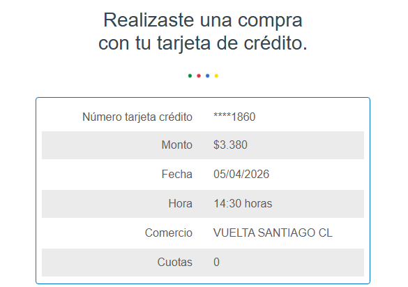
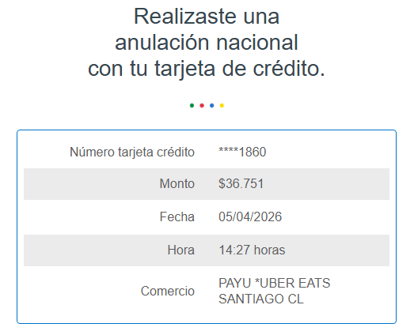
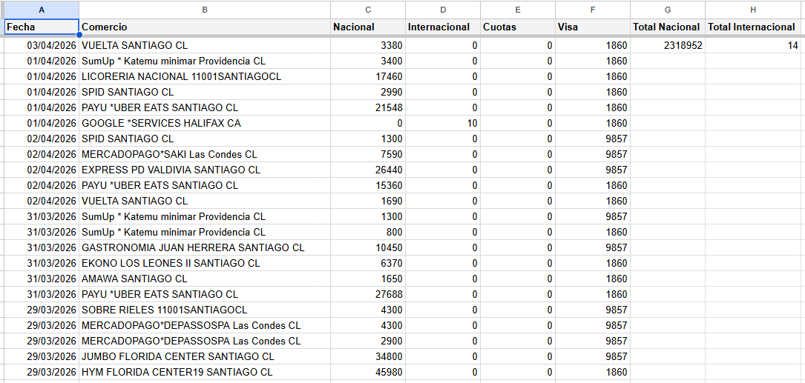

# Visa Expenses — Google Apps Script

🌐 [Leer en Español](README.es.md)

Automatically reads Visa credit-card notification emails from Gmail and logs each transaction into a Google Sheets spreadsheet, organized by billing month.

> **Important:** This script is designed for a specific email format (see below). For it to work, your bank must send Visa transaction notification emails whose plain-text body contains fields in this structure:
>
> ```
> Fecha       05/04/2026
> Comercio    STORE NAME
> Monto       $123.456          ← domestic (CLP)
> Monto       USD 99.50         ← international (USD)
> Cuotas      3
> Número tarjeta crédito ****1234
> ```
>
> If your notification emails use a different layout or field names, the regular expressions in the script will need to be adjusted accordingly.

## Prerequisites

| Requirement | Details |
|---|---|
| **Google Account** | Gmail + Google Sheets access |
| **Gmail Label** | A label named **`Visa`** applied to your bank's Visa notification emails. If you want to use a different label name, update the `'Visa'` string in the `GmailApp.getUserLabelByName('Visa')` call in `script.js` to match your label. |
| **Google Apps Script** | The script must be bound to (or have access to) the target spreadsheet |

## How It Works

### 1. Email Discovery

The function `registerVisaExpenses()` looks for the Gmail label **Visa** and iterates over every **unread** message in those threads.

### 2. Data Extraction

Each email body is parsed with regular expressions to extract:

| Field | Regex Pattern | Example Match |
|---|---|---|
| Domestic amount (CLP) | `Monto $123.456` | `123456` (dots removed, parsed as integer) |
| International amount (USD) | `Monto USD 99.50` | `99.50` (parsed as float) |
| Purchase date | `Fecha 05/04/2026` | `05/04/2026` |
| Merchant name | `Comercio STORE NAME` | `STORE NAME` |
| Card last 4 digits | `Número tarjeta crédito ****1234` | `1234` |
| Installments | `Cuotas 3` | `3` |

If the email contains the word **"anulación"** (reversal/void), both amounts are negated so they subtract from the totals.

### 3. Billing-Month Sheet Routing

Transactions are placed in a sheet whose name follows the pattern:

```
Facturacion <Month> <Year>
```

The billing month is determined by the **purchase date**:

- Purchases on or after the **20th** of a month are assigned to the **next** month's billing cycle.
- Purchases before the 20th stay in the **current** month's billing cycle.

**Example:** A purchase dated `22/03/2026` goes to the sheet `Facturacion Abril 2026`.

### 4. Automatic Sheet Setup

When a sheet for a billing month does not yet exist, the script:

1. Creates the sheet with the calculated name.
2. Writes bold headers in the first row (in Spanish):
   `Fecha | Comercio | Nacional | Internacional | Cuotas | Visa | Total Nacional | Total Internacional`
3. Freezes the header row.
4. Inserts `=SUM()` formulas in cells **G2** and **H2** to auto-total domestic and international amounts.
5. Applies number formats to the summary cells: `$#,##0` for CLP and `USD #,##0.00` for USD.

### 5. Row Insertion

The script finds the first empty row in column A (starting from row 2) and writes the extracted data there. Each row's domestic amount (column C) and international amount (column D) are formatted as `$#,##0` and `USD #,##0.00` respectively. Reversal rows are highlighted with a light-red background (`#fff0f0`).

After writing, the email is **marked as read** so it won't be processed again on the next run.

### 6. Error Handling

Any processing error for a single email is caught and logged to the Apps Script console without stopping the remaining emails.

## Email Examples





## Customization

The script includes `⚙️ CUSTOMIZE` comments marking every value you may need to change to adapt it to your bank or preferences:

| What to change | Where in `script.js` |
|---|---|
| Gmail label name | `GmailApp.getUserLabelByName('Visa')` |
| Cancellation keyword | `lowerBody.includes('anulación')` |
| Amount regex patterns | `Monto\s+\$` / `Monto\s+USD` |
| Date regex & format | `Fecha\s+(\d{2}\/\d{2}\/\d{4})` |
| Merchant regex | `Comercio\s+(.+)` |
| Card number regex | `Número tarjeta crédito\s+\*{4}(\d{4})` |
| Installments regex | `Cuotas\s+(\d+)` |
| Billing cycle cutoff day | `dateObject.getDate() >= 20` |
| Month names (language) | `monthNames` array |
| Sheet name prefix | `'Facturacion '` |
| Column headers | `headers` array |
| Currency formats | `'$#,##0'` / `'USD #,##0.00'` |

Search for `⚙️ CUSTOMIZE` in the script to find each one with detailed instructions.

## Setup

1. Open your target Google Spreadsheet.
2. Go to **Extensions → Apps Script**.
3. Paste the contents of `script.js` into the editor.
4. Save the project.
5. Create a Gmail label called **Visa** and apply it to your bank's Visa notification emails (you can use a Gmail filter to do this automatically).

### Running Manually

In the Apps Script editor, select `registerVisaExpenses` from the function dropdown and click **Run**. Grant the requested Gmail and Sheets permissions when prompted.

### Running Automatically (Trigger)

1. In the Apps Script editor go to **Triggers** (clock icon in the sidebar).
2. Click **+ Add Trigger**.
3. Configure:
   - **Function:** `registerVisaExpenses`
   - **Event source:** Time-driven
   - **Type:** Hours timer → **Every hour** (or choose any interval you prefer)
4. Save the trigger.

## Sheet Layout



| Column | Header (in script) | Content |
|---|---|---|
| A | Fecha | Purchase date (`dd/mm/yyyy`) |
| B | Comercio | Merchant name |
| C | Nacional | Domestic amount (CLP) |
| D | Internacional | International amount (USD) |
| E | Cuotas | Installments |
| F | Visa | Card last 4 digits |
| G | Total Nacional | Total domestic (formula) |
| H | Total Internacional | Total international (formula) |

## Permissions Required

- **Gmail** — read messages and mark as read (`GmailApp`)
- **Spreadsheet** — create sheets, read/write cells (`SpreadsheetApp`)

## Contributors ⭐

<!-- ALL-CONTRIBUTORS-LIST:START - Do not remove or modify this section -->
<!-- prettier-ignore-start -->
<!-- markdownlint-disable -->
<table>
  <tr>
    <td align="center"><a href="https://github.com/Phoebe-WD"><br /><sub><b>Phoebe Sttefi Wilckens Díaz</b></sub></a><br />💻 📖</td>
    <td align="center"><a href="https://github.com/leonardo-astete"><br /><sub><b>Leonardo Astete</b></sub></a><br />💻</td>
  </tr>
</table>

## License

This project is provided as-is for personal use.
